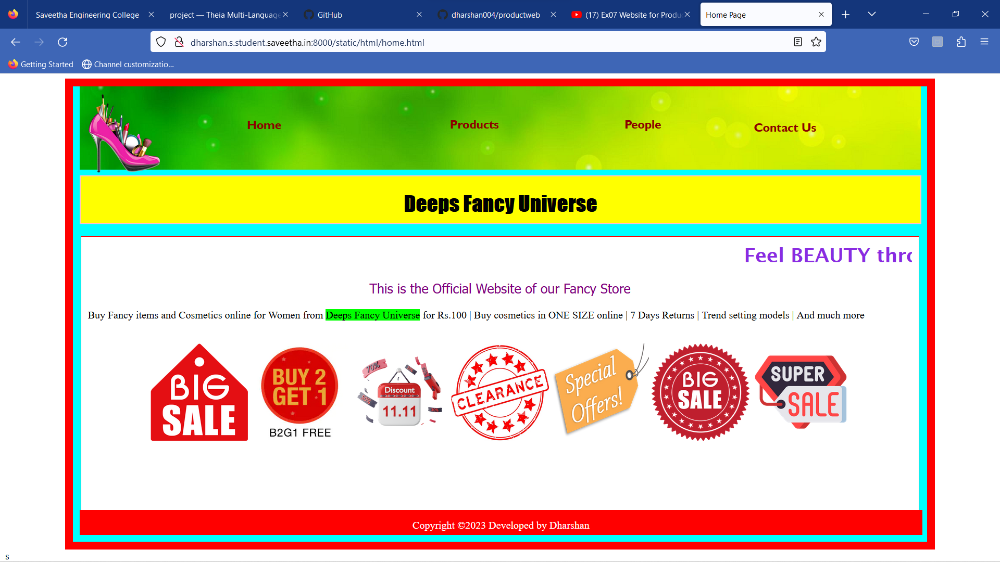
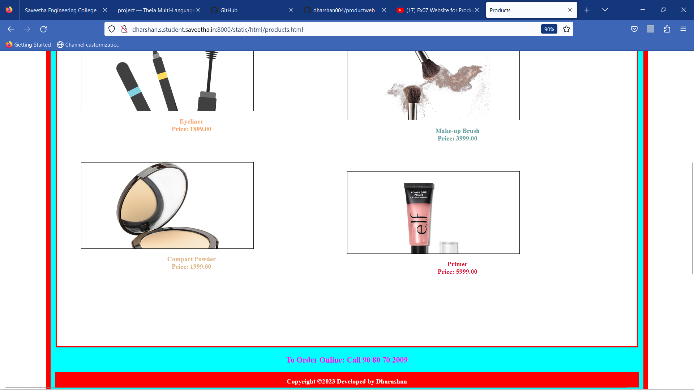
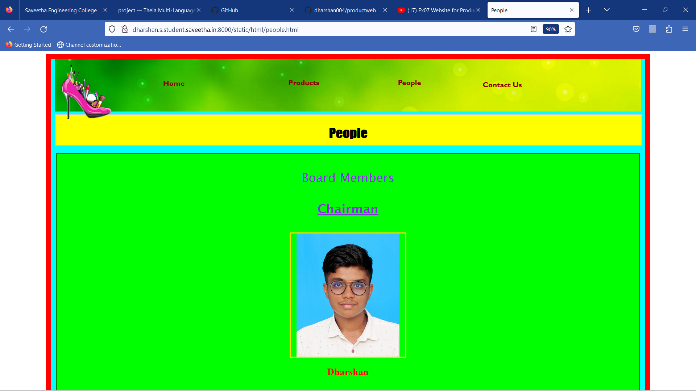

# Product Company Website
## AIM:
To develop a static company website to display the sale of products.

## Design Steps:

### Step 1:
Requirement collection.

### Step 2:
Creating the layout using HTML and CSS.

### Step 3:
Updating the sample content.

### Step 4:
Choose the appropriate style and color scheme.

### Step 5:
Validate the layout in various browsers.

### Step 6:
Validate the HTML code.

### Step 7:
Publish the website in the given URL.

## Code:
```
<!DOCTYPE html>
<html lang="en">
    <head>
        <title>
            Home Page
        </title>
        <meta name="viewport" 
         content="width=device-width, initial-scale=1.0">
        <link rel="stylesheet" href="/static/css/styles.css">
    <style>
    .text{
        color:blueviolet;
        font-family:'Lucida Sans';
        font-size: 30px;
        text-align:center;
    }
    img{
        height: 150px;
        width: 150px;
        align-items:center;
    }
    </style>

    </head>
    <body>
        <div class="home">
            <div class="header">
                <header>
                    <div class=logo></div>
                    <div class=h>
                    <a href="home.html" title="Home" style="color: darkred; text-decoration: none;"><b>Home</b></a></div>
                    <div class="prod">
                        <a href="products.html" title="Products" style="color: darkred; text-decoration: none;"><b>Products</b></a>
                    </div>
                    <div class="people">
                        <a href="people.html" title="People" style="color:darkred; text-decoration: none;"><b>People</b></a>
                    </div>
                    <div class="contact">
                        <a href="contact.html" title="Contact Us" style="color:darkred; text-decoration: none;"><b>Contact Us</b></a>
                    </div>
                </header>
                <div class="title">
                    <h1>Deeps Fancy Universe</h1>
                </div><br>
                <div class="content">
                    <div class="text">
                    <marquee><b>Feel BEAUTY through our Store</b></marquee>
                    <p style="color:purple; font-family:'Tahoma'; font-size:20px;"> This is the Official Website of our Fancy Store</p>
                    </div>
                    <p>Buy Fancy items and Cosmetics online for Women from <span style="background-color:lime">Deeps Fancy Universe</span>
                         for Rs.100 | Buy cosmetics in ONE SIZE online | 7 Days Returns | Trend setting models | And much more</p>
                    <br>
                <center>
                    
                    
                    
                    
                    
                    
                    
                </center>
                </div>
                <div class="footer">
                <footer style="color:white">
                Copyright &copy;2023 Developed by Dharshan</footer></div>
            </div>
        </div>
    </body>
</html>
```

## Output:







## Result:
The program for designing company website for sale of products using HTML and CSS is completed successfully.